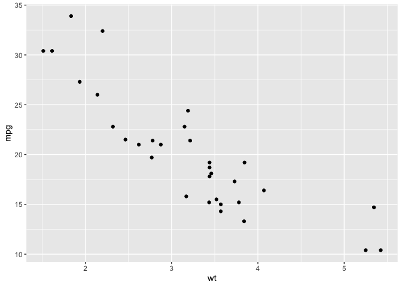

# R Lab 2 \| Intro to ggplot
Jeremy Morris
2024-03-27

# Introduction to ggplot2

`ggplot()` is the generic function call. A plot can include any of the
following objects.

- `ggplot` - the primary building block of a chart. By itself only
  generates a blank chart.
- `aes` - short for ‘aesthetic mapping’. This function tells the plot
  how to map data to different portions of the chart
  (e.g. x-axis,y-axis,fill,etc.)
- `geom` - short for ‘geometric object’. These are the actual charts,a
  short list of options follows.
  - `geom_point` - scatterplot
  - `geom_bar` - bar chart
  - `geom_line` - line chart
- `labs` - chart labels and titles
- `coord` - functions to modify the coordinate space. The most commonly
  used is `coord_flip` to rotate a chart 90 degrees.
- `facet` - these control how many charts are shown.
- `theme` - functions to modify the overall look and feel over the
  chart.

The great thing about ggplot is that it allows you to control nearly
every aspect of a data visualization. Because there is so much
control,there is also a learning curve associated with that level of
control.

The basic structure of a ggplot call is to first call the ggplot
function and then add the different components to the chart. The
aesthetic mappings can be added when `ggplot` is called or they can be
added in the individual geometric objects. If added in the `ggplot`
call,these aesthetic mappings will be used in all `geom` functions. You
would add them to the `geom` function if you wanted to override the
settings in `ggplot`.

### mtcars \| weight vs. miles per gallon

In this example,we have a basic `ggplot` call with data and aesthetic
mappings in the `ggplot` function. We then add `geom_point` to create a
scatterplot.

``` r
ggplot(mtcars,aes(x = wt,y = mpg)) +
    geom_point()
```



What happens if we don’t add a geometric object?

``` r
ggplot(mtcars,aes(x = wt,y = mpg)) 
```


As you can see, we get a blank chart. What happens if we just call
`ggplot` by itself?

``` r
ggplot() 
```


The point being, that we start with a blank slate. We add data, add
aesthetic mappings and add geometric objects to create a chart. We can
customize the chart more by adding labels, scales and themes. These will
be covered later in the lab.

### heightweight \| height vs. age

Now we’ll work with another data set that provides information on heigt
and weight.

- df.heightweight is an object of type tibble
- it has 236 observations and 5 variables
- variables have different types themselves,which constrain how we can
  visualize them effectively

``` r
df.heightweight <- read_csv(here('_data','heightweight.csv'))
df.heightweight
```

    # A tibble: 236 × 5
       sex   ageYear ageMonth heightIn weightLb
       <chr>   <dbl>    <dbl>    <dbl>    <dbl>
     1 f        11.9      143     56.3     85  
     2 f        12.9      155     62.3    105  
     3 f        12.8      153     63.3    108  
     4 f        13.4      161     59       92  
     5 f        15.9      191     62.5    112. 
     6 f        14.2      171     62.5    112  
     7 f        15.4      185     59      104  
     8 f        11.8      142     56.5     69  
     9 f        13.3      160     62       94.5
    10 f        11.7      140     53.8     68.5
    # ℹ 226 more rows

In this first example, we again create a scatterplot using `geom_point`.
Note that we are setting up the aesthetic mapping (`aes`) in the
top-level `ggplot` function.

``` r
ggplot(df.heightweight,aes(x = ageYear,y = heightIn)) + 
  geom_point()
```


- In summary: Our objective is similar to that in the previous example.
  However,we are using a different dataset (heightweight) and are
  interested in the relationship between height and age.

### heightweight \| height vs. age by gender

In this example,we add the ‘color’ aesthetic to the chart. You can see
that `ggplot` automatically recognizes the different levels in the ‘sex’
variable and colors them differently. We also move the aesthetic mapping
into the call to `geom_point`. This is an example of how we can control
the chart. By putting the aesthetic mapping in the geometric object, it
will be specific to that geometric object. When creating more
sophisticated charts, you can have multiple geometric objects all with
different aesthetic mappings (and even different data sets, but we’re
getting ahead of ourselves).

``` r
ggplot(df.heightweight) +  
  geom_point(aes(x = ageYear,y = heightIn,colour = sex))
```


If we want a simple bar chart showing the average height by sex,we first
pre-process the data calculating the average we want and then use
`geom_col`.

``` r
by_sex <- df.heightweight |> 
    group_by(sex) |> 
    summarise(mean_height=mean(heightIn))

ggplot(by_sex) +
  geom_col(aes(x=sex,y=mean_height))
```


We could also look at a boxplot for the same data to look at the
distribution of values. Notice that we are using the `fill` parameter to
specify the background color for the boxes.

``` r
ggplot(df.heightweight) +                          
  geom_boxplot(aes(x=sex,y=heightIn,fill=sex)) 
```


<div>

> **Note**
>
> The difference between these charts is the geometric object we are
> using. All chart-type decisions in `ggplot` are made by selecting
> different geometric objects. A list of geometric objects can be found
> [here](https://ggplot2.tidyverse.org/reference/#geoms).

</div>

We can also use `fill` to control the background color for barplots. If
we revisit the plot we created earlier, we can see how the background
color is added via `fill`.

``` r
ggplot(by_sex) +
  geom_col(aes(x=sex,y=mean_height,fill=sex))
```


## Additional chart options

### Labels

As mentioned, nearly all of the chart can be customized using `ggplot`.
We will cover two of those before we finish here.

First, we’ll cover the `labs` function. This function allows you to add
labels to a chart. For an example, we will go back to our height/weight
data and will add labels to the scatterplot. These are the main labels
that can be added to a chart. Labels can be added to the content of the
chart via a geometric object (not covered here).

``` r
base_df_plot <- ggplot(df.heightweight) +  
    geom_point(aes(x = ageYear,y = heightIn,colour = sex)) +
    labs(x='Age (Years)',y='Height (In)',colour='Sex',
         title='Height Increases with Age',
         subtitle='This is a subtitle',
         caption='This is a caption')

base_df_plot
```


### Themes

We can also control the overall look and feel of the chart with `theme`
functions. The individual elements of the theme can also be adjusted,
but we won’t cover that here. So far, we’ve seen charts using the
default theme which is called `theme_gray`. We’ll show a few of the
other themes.

`theme_bw`

``` r
base_df_plot +
    theme_bw()
```


`theme_classic`

``` r
base_df_plot +
    theme_classic()
```


`theme_void`

``` r
base_df_plot +
    theme_void()
```


## Summary

In this lab, we have seen the basics of how `ggplot` works and looked at
a few examples. We see that ggplot works using the concept of layering
chart elements on top of each other and allows us to control various
elements of the chart. We also see that we may need to pre-aggregate
some of our data in order to create the desired chart. For the lab
assignment, I’ll provide a set of building blocks and then have you put
two charts together using those building blocks.
